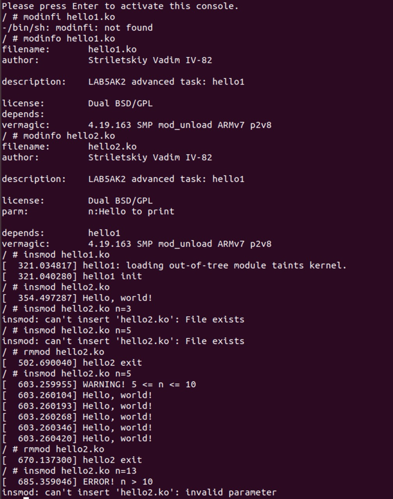

# LAB5AK2
## Лістинг:

### Makefile

```makefile

# add files from /inc to path
ccflags-y := -I$(PWD)/inc

ifneq ($(KERNELRELEASE),)
	# kbuild part of makefile
	obj-m := hello1.o hello2.o
else
	# normal makefile
	KDIR ?= /lib/modules/`uname -r`/build

default:
	$(MAKE) -C $(KDIR) M=$$PWD
clean:
	$(MAKE) -C $(KDIR) M=$$PWD clean
endif
```

### hello1.c

```c
// SPDX-License-Identifier: GPL-2-Clause
#include <linux/init.h>
#include <linux/module.h>
#include <linux/printk.h>
#include <linux/types.h>

#include <hello1.h>

MODULE_LICENSE("Dual BSD/GPL");
MODULE_DESCRIPTION("LAB5AK2 advanced task: hello1\n");
MODULE_AUTHOR("Striletskiy Vadim IV-82\n");

static int helloFunction(uint n)
{
        int i;
        if (n < 0) {
                pr_err("ERROR! n < 0\n");
        }
        else if (n == 0) {
                pr_warn("WARNING! n = 0\n");
        }
        else if (n >= 5 && n <= 10) {
                pr_warn("WARNING! 5 <= n <= 10\n");
        }
        else if (n > 10) {
                pr_err("ERROR! n > 10\n");
                return -EINVAL;
        }
        for (i = 0; i < n; i++) {
                pr_info("Hello, world!\n");
        }
        return 0;
}

EXPORT_SYMBOL(helloFunction);

static int __init hello1_init(void)
{
        pr_info("hello1 init\n");
        return 0;
}

static void __exit hello1_exit(void)
{
        pr_info("hello1 exit\n");
}

module_init(hello1_init);
module_exit(hello1_exit);
```

### hello2.c

```c
// SPDX-License-Identifier: GPL-2-Clause
#include <linux/init.h>
#include <linux/module.h>
#include <linux/types.h>

#include <hello1.h>

MODULE_LICENSE("Dual BSD/GPL");
MODULE_DESCRIPTION("LAB5AK2 advanced task: hello1\n");
MODULE_AUTHOR("Striletskiy Vadim IV-82\n");

static uint n = 1;
module_param(n, uint, 0);
MODULE_PARM_DESC(n, "How many hellos to print\n");

static int hello_init(void)
{
        return helloFunction(n);
}

static void hello_exit(void)
{
        printk(KERN_ALERT "hello2 exit\n");
}

module_init(hello_init);
module_exit(hello_exit);
```

### hello.h

```cpp
#include <linux/types.h>
static int helloFunction(uint n);
```
### Результати роботи


